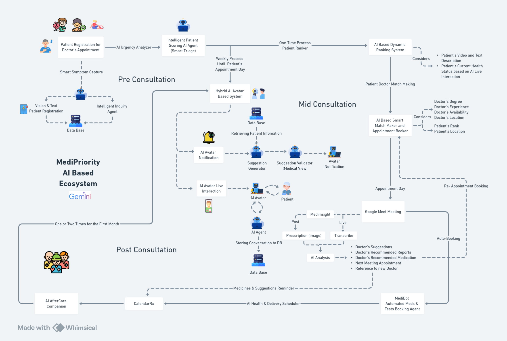
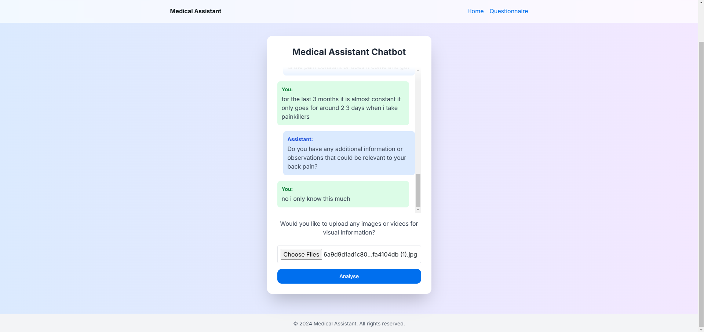
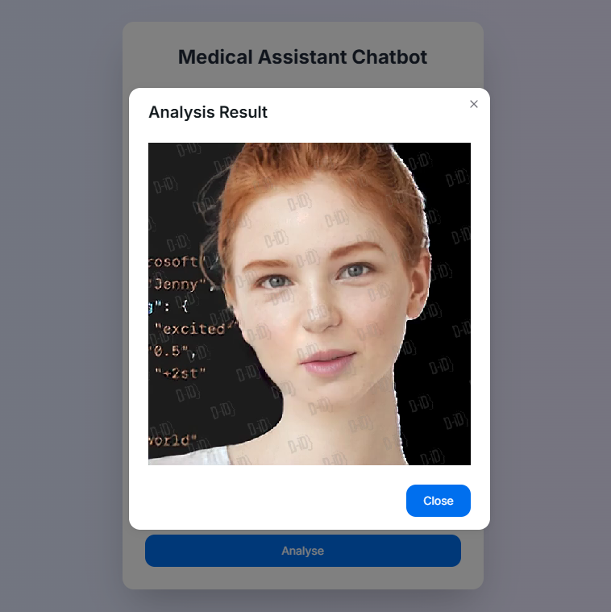

# 🏥 MediPriority

### 📋 Overview

MediPriority is an AI-driven healthcare management system designed to streamline the patient care journey from pre-consultation to post-consultation. Leveraging advanced AI technologies, MediPriority aims to improve patient outcomes, enhance efficiency, and reduce the administrative burden on healthcare providers. Key features include multi-agent AI systems for various tasks, dynamic urgency scoring, visual analysis, personalized AI avatars, and seamless integration with everyday tools like Google Calendar.

## 🌟 Key Features

### 1. 🤖 Multi-Agent AI System

- **Text Analysis Agent:** 📝 Extracts relevant information from patient inputs using NLP.
- **Video Analysis Agent:** 🎥 Analyzes patient-submitted videos for initial assessments using computer vision.
- **Urgency Scoring Agent:** ⚡ Dynamically updates patient prioritization scores based on triage assessments and external factors.
- **Personalized Recommendation Agent:** 💡 Provides tailored health advice based on patient data.

### 2. 📊 Dynamic Urgency Scoring

- **Dual-Factor Ranking System:** 📈 Combines triage-based assessment with external factors for real-time prioritization.
- **Continuous Updates:** 🔄 Ensures real-time adaptation to changing patient conditions.

### 3. 👁️ Visual Analysis Integration

- **Image and Video Analysis:** 📸 Allows for comprehensive initial evaluations by catching visual cues.

### 4. 🤝 AI Avatar for Patient Support

- **Personalized AI Avatar:** 🤖 Bridges the gap between clinical care and daily health management by providing post-consultation support.

### 5. 📅 Seamless Calendar Integration

- **Google Calendar Integration:** 🗓️ Facilitates appointment scheduling and medication reminders, making the system user-friendly.

### 6. 💊 Automated Medication Ordering

- **Online Pharmacy Integration:** 🏪 Automatically adds prescribed medications to online pharmacy carts to improve adherence.

### 7. 🔄 Holistic Patient Journey Management

- **Comprehensive Integration:** 🎯 Manages pre-consultation, consultation, and post-consultation processes in a single AI-driven system.

### 8. 🎙️ Real-Time Consultation Support

- **Speech Recognition:** 🗣️ Transcribes doctor-patient conversations for accurate capture of details.
- **Interaction Analysis:** 💬 Provides real-time support during consultations.

### 9. 🤝 Patient-Doctor Matchmaking and Dynamic Appointment Booking

- **Matchmaking System:** 🤝 Uses AI to match patients with the most suitable doctors based on their medical needs and preferences.
- **Dynamic Booking System:** 📈 Adjusts appointment schedules dynamically based on urgency and availability, ensuring optimal resource allocation.

## Screenshots

- Medical assistant bot

    

- AI Virtual advisor video

    

## Implementation Details

### Technology Stack

- **Backend:** Node.js, Express.js
- **Frontend:** React.js
- **Database:** MongoDB
- **AI Framework:** Crew AI framework for coordinating multiple AI agents
- **Integration:** Google Calendar API, e-commerce platforms for medication ordering

### Code Quality

- **Modular Architecture:** Distinct components for input processing, prioritization, consultation support, etc.
- **Structured Approach:** Crew AI framework ensures well-organized and maintainable code.

### Usability

- **User-Friendly Interfaces:** AI chatbot, Google Calendar integration, and AI avatar enhance usability.
- **Automated Features:** Appointment scheduling, medication reminders, and ordering simplify processes for users.

### Efficiency

- **AI-Driven Processes:** High efficiency in processing and decision-making.
- **Real-Time Updates:** Quick response to changing conditions.
- **Streamlined Integration:** Efficient use of APIs for external system integration.

## Scalability and Impact

### Scalability

- **Cloud-Based Deployment:** Potential for elastic scaling on cloud platforms.
- **Modular Design:** Independent scaling of different components.
- **AI Efficiency:** Handles increased patient volumes without proportional increase in resources.

### Real-World Impact

- **Improved Patient Care:** Faster access to care and better treatment adherence.
- **Increased Efficiency:** Reduced administrative burden and optimized resource use.
- **Cost Reduction:** Significant savings through automation.
- **Enhanced Patient Experience:** Improved satisfaction and empowerment in health management.
- **Data-Driven Insights:** Valuable insights for healthcare providers and policymakers.
- **Addressing Healthcare Disparities:** Equitable access through urgency-based prioritization.
- **Pandemic Preparedness:** Effective triage and patient management during health crises.

## ⚠️ Challenges

- **Consistency and Bias:** Ensuring consistent AI performance and avoiding bias.
- **Trust and Adoption:** 🤝 Gaining trust from healthcare providers and patients.
- **Regulatory Compliance:** ⚖️ Navigating complex healthcare regulations.
- **Transition Management:** 📈 Managing the shift from traditional systems and training staff.

## 🎯 Conclusion

MediPriority is a comprehensive, AI-driven healthcare management system with significant potential for scalability and real-world impact. Its innovative features and efficient design aim to transform healthcare delivery, improving outcomes, efficiency, and patient satisfaction. Successful implementation and scaling will require careful management of technical, regulatory, and social challenges.

## Contact

For further information, please contact pmsoni2016@gmail.com.
